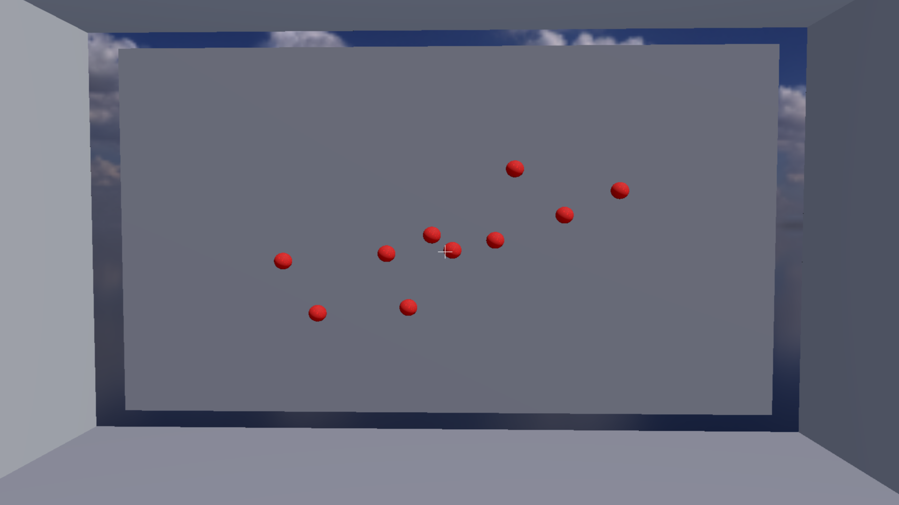

#  OpenGL Render Engine - Aim Trainer

An **aim trainer** built in **C++** and **OpenGL**, featuring a full **Physically Based Rendering (PBR)** pipeline with **Image-Based Lighting (IBL)**.  
This project goes beyond basic rendering to deliver realistic materials, lighting, and real time interactivity.

---

## 🖼️ Screenshots

  

---

## ✨ Core Features

- **Real-time 3D Rendering** using modern OpenGL.  
- **Physically-Based Rendering (PBR)** for realistic material definition.  
- **Image-Based Lighting (IBL)** using an HDR skybox for realistic ambient light and reflections.  
- **Dynamic Lighting** including:
  - Directional sunlight  
  - Toggleable spotlight (flashlight)  
- **First-Person Camera Controller** with WASD movement and mouse look.  
- **Raycasting** from the camera for accurate hit detection on targets.  
- **Procedural Sphere Generation** for creating target geometry.  

---

## 🎮 Controls

| Key / Action | Description |
|---------------|-------------|
| **W / A / S / D** | Move the camera forward, left, backward, right |
| **Mouse** | Look around |
| **Left Mouse Click** | Shoot (fire a raycast) |
| **E** | Toggle the flashlight (spotlight) |
| **ESC** | Close the application |

---

## 🚀 Future Work

- Implement a scoring system and timed game modes  
- Load textured PBR materials (albedo, normal, roughness maps)  
- Add dynamic shadows from the directional light  
- Expand the scene with more complex geometry  
- **Model Loading** for importing complex 3D assets  
- **Sound Effects** for shooting, hits, and ambient environment  

---

## 🙏 Acknowledgments

- **HDR Skybox** by [Poly Haven](https://polyhaven.com)

---
- **Rendering Model:** Physically Based Rendering (PBR)  
- **Lighting:** Image-Based Lighting (IBL)
